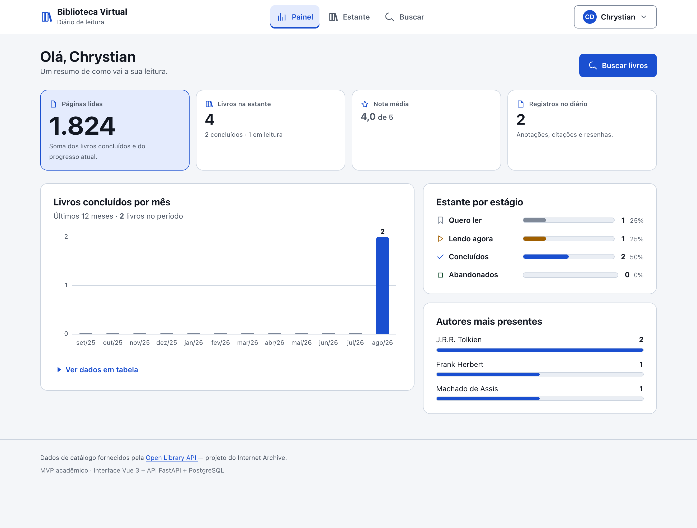
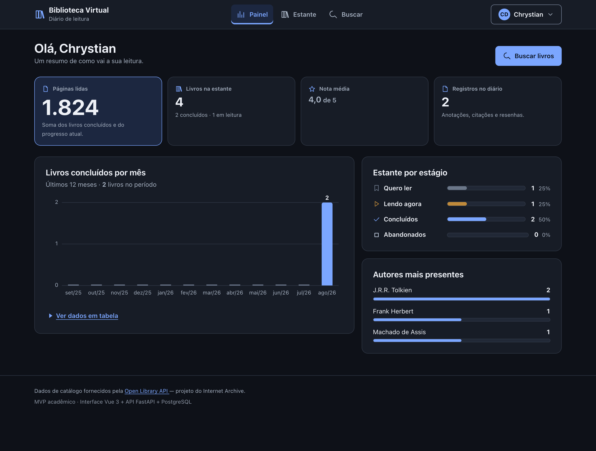
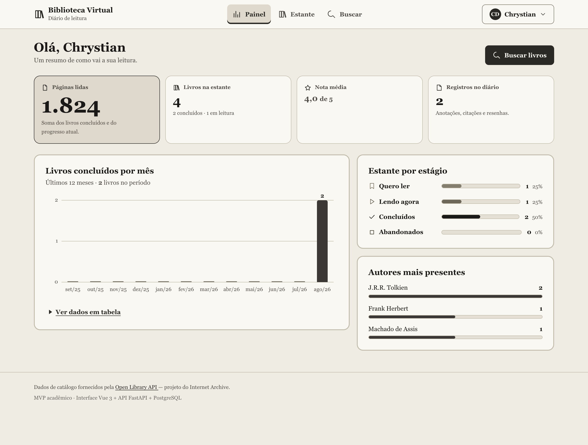
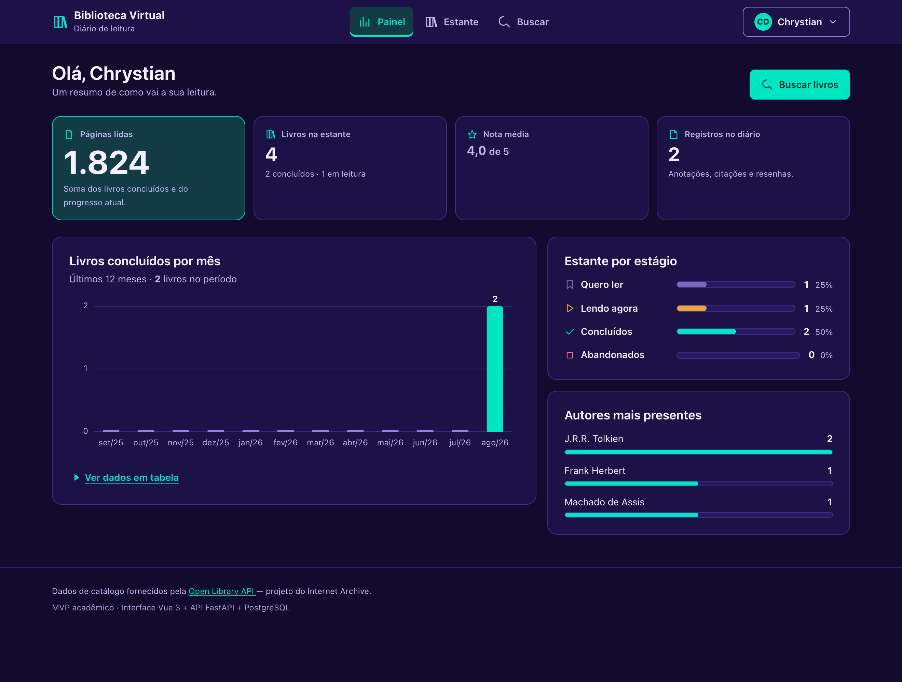
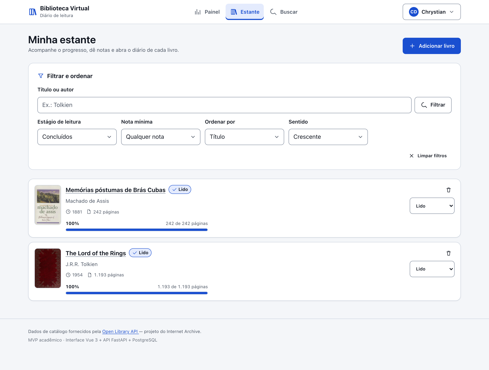
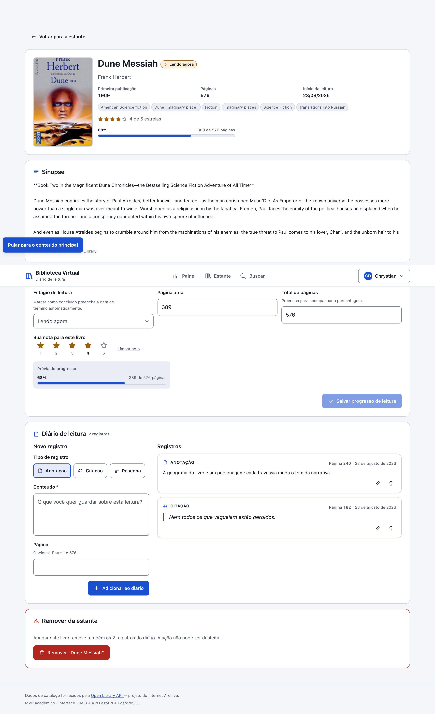
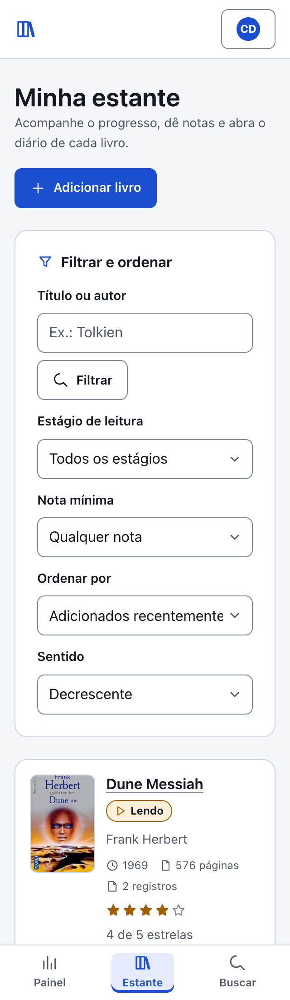

# Biblioteca Virtual — Interface

Interface web do **Diário de Leitura e Biblioteca Virtual**, construída em
Vue 3. É o módulo principal do MVP: a tela onde o leitor busca livros no acervo
aberto da Open Library, monta a própria estante, acompanha o progresso de cada
leitura e escreve anotações, citações e resenhas.

| | |
| --- | --- |
| **Módulo** | 1 de 3 — Interface (Front-End), componente principal |
| **Cenário do enunciado** | 1.1 — Interface → API → API Externa |
| **Repositório par** | [`biblioteca-virtual-api`](https://github.com/ChrystiandaHora/biblioteca-virtual-api) — a API que esta interface consome |
| **Stack** | Vue 3 · Vite · Pinia · vue-router · Nginx · Docker |
| **Acessibilidade** | WCAG 2.1 AA · 4 temas · 180 pares de contraste validados por script |

## Sumário

- [O problema que este projeto resolve](#o-problema-que-este-projeto-resolve)
- [Arquitetura](#arquitetura)
- [Telas](#telas)
- [Funcionalidades](#funcionalidades)
- [Acessibilidade](#acessibilidade)
- [Responsividade](#responsividade)
- [Requisitos](#requisitos)
- [Como executar](#como-executar)
- [Primeiros passos na aplicação](#primeiros-passos-na-aplicação)
- [Estrutura do projeto](#estrutura-do-projeto)
- [Decisões técnicas](#decisões-técnicas)
- [Licença](#licença)

---

## O problema que este projeto resolve

Quem lê muito acaba espalhando o acompanhamento por vários lugares: uma
planilha com o que já leu, o aplicativo do e-reader com o progresso, um caderno
com as citações que valeu a pena guardar, e a memória para o resto. Nada disso
conversa entre si, e a pergunta simples — *"o que eu achei daquele livro que li
no ano passado?"* — normalmente não tem resposta.

A Biblioteca Virtual junta as três coisas em um só lugar: **catálogo**
(de onde vêm os dados do livro), **progresso** (onde você está em cada leitura)
e **diário** (o que você pensou enquanto lia).

---

## Arquitetura


O MVP segue o **Cenário 1.1**: Interface (Front-End) → API (Back-End) → API
Externa, com a persistência ligada ao back-end.

| Módulo | Papel | Tecnologia |
| --- | --- | --- |
| **Interface (Front-End)** — este repo | Telas do usuário | Vue 3 + Vite + Nginx |
| API (Back-End) | Regras de negócio, autenticação, persistência | Python + FastAPI + SQLAlchemy |
| PostgreSQL | Armazenamento | PostgreSQL 16 |
| Open Library API | Catálogo de livros (externo) | Serviço público do Internet Archive |

### Estratégia de comunicação

Toda a comunicação sai daqui em **REST/JSON** para a API do back-end. O token
JWT viaja no cabeçalho `Authorization: Bearer …` e é adicionado em um único
lugar — [`src/services/httpClient.js`](src/services/httpClient.js) — em vez de
ser repetido em cada chamada.

**A interface não conhece a Open Library.** Ela não tem a URL do serviço
externo, não sabe o formato do JSON dele e nunca redireciona o usuário para
`openlibrary.org`. Quando alguém busca "duna", a interface chama
`GET /api/books/search?q=duna` na *nossa* API, que consulta a Open Library,
trata a resposta e devolve o formato do nosso domínio. Isso atende ao requisito
do MVP de que os dados externos sejam consumidos e tratados dentro da aplicação.

| Ação na tela | Chamada à nossa API | Método |
| --- | --- | --- |
| Criar conta | `/api/auth/register` | `POST` |
| Entrar | `/api/auth/login` | `POST` |
| Restaurar a sessão ao abrir | `/api/auth/me` | `GET` |
| Buscar livros | `/api/books/search` | `GET` |
| Ver sinopse | `/api/books/{work_key}` | `GET` |
| Listar a estante (com filtros) | `/api/library` | `GET` |
| Adicionar livro | `/api/library` | `POST` |
| Atualizar status, progresso, nota | `/api/library/{id}` | `PUT` |
| Remover livro | `/api/library/{id}` | `DELETE` |
| Registrar no diário | `/api/library/{id}/diary` | `POST` |
| Editar registro do diário | `/api/diary/{id}` | `PUT` |
| Apagar registro do diário | `/api/diary/{id}` | `DELETE` |
| Carregar o painel | `/api/stats` | `GET` |

Os quatro métodos HTTP exigidos (`GET`, `POST`, `PUT`, `DELETE`) são exercitados
pela interface.

### API externa

Os dados de catálogo vêm da [Open Library](https://openlibrary.org/developers/api),
serviço público e gratuito do Internet Archive, que **não exige cadastro nem
chave de API**. A documentação completa da integração — endpoints consumidos,
licença dos dados, tratamento de falhas — está no
[README da API](https://github.com/ChrystiandaHora/biblioteca-virtual-api#api-externa-utilizada).

---

## Telas

### Os quatro temas

Cada tema tem os próprios passos de cor, validados contra o próprio fundo — não
é um tema claro invertido automaticamente.

| Claro | Escuro |
| --- | --- |
|  |  |

| Tinta | Vibrante |
| --- | --- |
|  |  |

O tema **Tinta** é monocromático de propósito: ele funciona como teste vivo da
regra de que nenhum estado desta interface é comunicado apenas por cor.

### Estante e diário

| | |
| --- | --- |
|  |  |
| Estante com filtro e ordenação aplicados | Detalhe do livro com o diário de leitura |

### Em 320px de largura



Sem rolagem horizontal em 320px nem com zoom de 200%.

---

## Funcionalidades

### Painel de leitura
Números consolidados (páginas lidas, livros na estante, nota média, registros no
diário), um gráfico de colunas com os livros concluídos por mês nos últimos 12
meses, a distribuição da estante por estágio de leitura e os autores mais
presentes.

### Busca no catálogo
Pesquisa por título, autor ou assunto, com paginação e sugestões para começar.
Livros já presentes na estante aparecem marcados, para não adicionar duas vezes.
O termo buscado fica na URL, então o resultado é compartilhável e o botão
"voltar" do navegador se comporta como esperado.

### Minha estante
Lista com **filtros combináveis** (estágio de leitura, texto livre em título ou
autor, assunto, nota mínima), **ordenação** por seis campos em ambos os
sentidos, e **paginação**. Os filtros ficam na URL e sobrevivem a um
recarregamento. O status de cada livro pode ser trocado direto na lista.

### Detalhe do livro
Sinopse trazida da Open Library, fatos da obra, acompanhamento de progresso com
prévia ao vivo antes de salvar, nota de 1 a 5 estrelas e o diário de leitura
completo.

### Diário de leitura
Três tipos de registro — **anotação**, **citação** e **resenha** — com página
opcional. Citações são renderizadas como citação de verdade (`<blockquote>`),
não como texto entre aspas.

### Quatro temas
- **Claro** — fundo branco com texto escuro
- **Escuro** — para ambientes com pouca luz
- **Tinta** — papel monocromático sem saturação, no estilo de leitores de tinta
  eletrônica, com tipografia serifada e sem sombras
- **Vibrante** — violeta profundo com destaques em turquesa

A escolha fica salva no navegador e é aplicada **antes da primeira pintura**, então
a página nunca aparece no tema errado e pisca depois.

---

## Acessibilidade

O projeto foi construído seguindo as diretrizes de
[A11Y.md](https://github.com/fecarrico/A11Y.md/blob/main/docs/en/A11Y.md), no
perfil **Standard (WCAG 2.1/2.2 nível AA)**.

Dez falhas reais de acessibilidade apareceram durante o desenvolvimento e foram
corrigidas na raiz, não contornadas. As mais instrutivas:

| Falha | Causa raiz | Correção |
| --- | --- | --- |
| O anel de foco não alcançava 3:1 sobre os botões primários em nenhum tema | Um anel interno fica sobre a cor do botão, e nenhum tom vencia os quatro | Passou a ser `outline` + `outline-offset`: o anel é desenhado **fora** do elemento, sobre o fundo, e o par validado passa a ser foco-vs-fundo |
| O skip link não era alcançável com `Tab` | O foco era movido para o `<main>` também na primeira carga. O vue-router aciona o observador **duas vezes** ao subir (rota vazia → rota resolvida), então um guard de "pule a primeira vez" não bastava | O foco só é reposicionado a partir da segunda rota |
| Dois botões "Salvar alterações" na mesma tela | Visualmente distintos pelo painel, mas idênticos na lista de botões do leitor de tela | Rótulos passaram a dizer o que salvam: "Salvar registro do diário" e "Salvar progresso de leitura" |
| Os rótulos do gráfico renderizavam a ~9px | O `viewBox` escalava, e o `svg { max-width: 100% }` do reset encolhia o desenho em vez de deixar o contêiner rolar | A largura do `viewBox` acompanha a largura medida do contêiner, garantindo escala 1:1 |
| Faixas de acionamento das colunas com 23px em telas estreitas | Largura mínima do gráfico era um valor fixo | A largura mínima passou a ser derivada da quantidade de meses |
| Divisores de menu invisíveis | Contêiner `flex column` com `max-height` e rolagem: os itens encolhem, e uma linha de 1px colapsava para altura zero | `flex-shrink: 0` no divisor, e o mesmo cuidado no cabeçalho e rodapé do diálogo |

O que **não** está verificado, e por quê: teste com leitor de tela real
(NVDA, VoiceOver, TalkBack), controle por voz, simuladores de deficiência de
cor, ajuste de espaçamento de texto e auditoria com axe-core dependem de
validação humana. Verificação por leitura de código não substitui verificação
por uso.

### Verificações automatizadas

```bash
npm run check:a11y      # roda as duas verificações abaixo
npm run lint            # ESLint + eslint-plugin-vuejs-accessibility
npm run check:contrast  # contraste de todos os pares de cor dos 4 temas
```

O `check:contrast` lê os valores **direto de**
[`src/styles/themes.css`](src/styles/themes.css) — não há paleta duplicada em
lugar nenhum — e verifica **180 pares** de cor contra os limites AA (4,5:1 para
texto, 3:1 para componentes de interface e bordas). Alterar qualquer cor sem
rodar o script derruba a verificação.

### Decisões que valem destaque

- **Estado nunca é comunicado só por cor.** Todo estágio de leitura carrega
  ícone + rótulo textual + cor. É por isso que o tema monocromático "Tinta"
  funciona sem perda de informação — e ele serve como teste vivo dessa regra.
- **O texto alternativo do gráfico é o próprio dado**, não a descrição do
  desenho: existe uma tabela equivalente com os 12 meses, sempre disponível.
  Cada coluna também é focável por teclado e mostra o mesmo valor do hover.
- **Foco visível, nunca removido.** O anel usa `outline` + `outline-offset`,
  portanto é desenhado *fora* do elemento, sobre o fundo — foi assim que
  conseguimos 3:1 de contraste em todos os temas, inclusive sobre botões
  coloridos.
- **Foco reposicionado na navegação**, mas só em navegação de verdade: na
  primeira carga o foco fica onde o navegador o deixou, para que o skip link
  continue sendo o primeiro elemento alcançável por Tab.
- **Modais com contrato completo:** o foco entra, fica preso, Esc fecha e o foco
  volta para o botão que abriu.
- **Colar é permitido no campo de senha**, e `autocomplete` está declarado.
  Bloquear o `paste` reintroduziria o teste de memória que o critério existe
  para eliminar.
- **Nada de `div` clicável.** Onde há ação, há `<button>` ou `<a>` nativo.
- **Movimento é opcional:** o caminho sem animação é o padrão, e o movimento só
  entra sob `prefers-reduced-motion: no-preference`.
- **Alvos de toque de 44px** (piso ergonômico adotado), acima do mínimo
  normativo de 24px, com 8px entre alvos vizinhos.

---

## Responsividade

| Largura | Comportamento |
| --- | --- |
| 320px | Layout de coluna única; navegação vira barra inferior fixa, respeitando a área segura de aparelhos com barra de gestos |
| ≥ 34rem | Cartões de livro passam a capa + conteúdo + ações em linha |
| ≥ 48rem | Navegação volta ao cabeçalho, na horizontal |
| ≥ 60rem | Diário fica ao lado do formulário |
| ≥ 64rem | Painel em duas colunas |

Verificado sem rolagem horizontal em **320px** e com **zoom de 200%**. Conteúdo
largo (tabelas, gráfico) rola dentro do próprio contêiner — a página em si nunca
rola na horizontal.

---

## Requisitos

- [Docker](https://docs.docker.com/get-docker/) — caminho recomendado
- Ou [Node.js](https://nodejs.org/) 20+ e npm, para desenvolvimento
- **A API precisa estar rodando.** Suba primeiro o
  [`biblioteca-virtual-api`](https://github.com/ChrystiandaHora/biblioteca-virtual-api)

---

## Como executar

### Opção 1 — Docker (recomendado)

A URL da API é embutida no bundle em tempo de **build** (é assim que o Vite
funciona), então ela entra como argumento de build:

```bash
# 1. Clone o repositório
git clone https://github.com/ChrystiandaHora/biblioteca-virtual-ui.git
cd biblioteca-virtual-ui

# 2. Construa a imagem apontando para a sua API
docker build --build-arg VITE_API_URL=http://localhost:8000 -t biblioteca-web .

# 3. Rode
docker run --rm -p 8080:80 biblioteca-web
```

Abra <http://localhost:8080>.

> `VITE_API_URL` deve ser o endereço que o **navegador** usa para alcançar a
> API — não o nome do serviço dentro do Docker. A requisição sai da máquina de
> quem acessa, não de dentro do container.

### Opção 2 — Desenvolvimento local

```bash
npm install

cp .env.example .env.local
# ajuste VITE_API_URL se a sua API não estiver em http://localhost:8000

npm run dev
```

Abra <http://localhost:5173>.

Se a API estiver em outra porta, ela precisa autorizar a origem do front no
`CORS_ORIGINS` dela.

### Comandos disponíveis

| Comando | O que faz |
| --- | --- |
| `npm run dev` | Servidor de desenvolvimento com recarga automática |
| `npm run build` | Gera os arquivos estáticos em `dist/` |
| `npm run preview` | Serve localmente o resultado do build |
| `npm run lint` | ESLint, incluindo as regras de acessibilidade |
| `npm run check:contrast` | Valida o contraste dos 4 temas |
| `npm run check:a11y` | Roda `lint` + `check:contrast` |

---

## Primeiros passos na aplicação

1. Abra a interface e clique em **Criar uma conta gratuita**.
2. Preencha nome, e-mail e uma senha de ao menos 8 caracteres — você entra
   direto, sem precisar digitar as credenciais de novo.
3. Você cai na tela de **busca**. Pesquise um livro (ou clique em uma sugestão).
4. Clique em **Adicionar** em um resultado.
5. Vá para **Estante**, troque o status para *Lendo*, e abra o livro pelo título.
6. No detalhe, informe o total de páginas e a página atual, salve, e escreva a
   primeira citação no diário.
7. Volte ao **Painel** para ver os números se preencherem.
8. Abra o menu da conta, no canto superior direito, para experimentar os
   **quatro temas**.

---

## Estrutura do projeto

```
biblioteca-virtual-ui/
├── Dockerfile                  # build em duas etapas: Node -> Nginx
├── nginx.conf                  # fallback de SPA + cabeçalhos de cache
├── .env.example
├── eslint.config.js            # inclui as regras de acessibilidade
├── docs/
│   └── arquitetura.svg         # fluxograma da arquitetura
├── scripts/
│   └── check-contrast.mjs      # validador de contraste dos temas
├── public/
│   └── favicon.svg
└── src/
    ├── main.js
    ├── App.vue                 # casca: skip link, foco por rota, rodapé
    ├── router/index.js         # rotas + guarda de autenticação
    ├── domain/
    │   └── readingStatus.js    # catálogo de estágios (rótulo + ícone + cor)
    ├── services/               # uma função por chamada à API
    │   ├── httpClient.js       # fetch central, JWT, tradução de erros
    │   ├── authService.js
    │   ├── bookService.js
    │   ├── libraryService.js
    │   └── statsService.js
    ├── stores/                 # Pinia
    │   ├── authStore.js
    │   ├── themeStore.js
    │   └── toastStore.js
    ├── composables/
    │   ├── useFocusTrap.js     # contrato de foco dos modais
    │   └── useAsyncResource.js # estados de carregando/erro/dados
    ├── styles/
    │   ├── themes.css          # tokens dos 4 temas (fonte da verdade)
    │   └── base.css            # reset, foco, movimento reduzido, utilitários
    ├── components/             # PascalCase, convenção do Vue
    │   ├── AppHeader.vue
    │   ├── BaseButton.vue
    │   ├── BaseField.vue
    │   ├── BaseIcon.vue
    │   ├── BaseModal.vue
    │   ├── BaseSelect.vue
    │   ├── BookCover.vue
    │   ├── BookListItem.vue
    │   ├── DiaryEntryCard.vue
    │   ├── DiaryEntryForm.vue
    │   ├── EmptyState.vue
    │   ├── MonthlyChart.vue    # gráfico em SVG + tabela equivalente
    │   ├── PaginationNav.vue
    │   ├── ProgressMeter.vue
    │   ├── RatingInput.vue
    │   ├── SearchResultItem.vue
    │   ├── SkeletonList.vue
    │   ├── StatTile.vue
    │   ├── StatusBadge.vue
    │   ├── StatusBreakdown.vue
    │   ├── ThemePicker.vue
    │   └── ToastRegion.vue
    └── views/
        ├── DashboardView.vue
        ├── SearchView.vue
        ├── LibraryView.vue
        ├── BookDetailView.vue
        ├── LoginView.vue
        ├── RegisterView.vue
        └── NotFoundView.vue
```

Componentes em `PascalCase` e módulos JavaScript em `camelCase`, seguindo a
convenção do ecossistema Vue.

---

## Decisões técnicas

**Sem biblioteca de componentes.** A interface é escrita com HTML semântico e
CSS próprio, organizados em tokens. O motivo é controle: com uma biblioteca
pronta, garantir 4,5:1 de contraste em quatro temas — incluindo um
monocromático — significaria lutar contra os valores dela. Com tokens próprios,
o [validador](scripts/check-contrast.mjs) confere cada par.

**Gráfico em SVG escrito à mão.** Uma biblioteca de gráficos entregaria mais
rápido, mas o gráfico precisava de tabela equivalente, colunas focáveis por
teclado, cores derivadas dos tokens do tema ativo e nenhuma animação sob
`prefers-reduced-motion`. Sai mais limpo controlando o SVG diretamente.

**Elementos nativos sempre que existem.** `<select>` em vez de combobox
customizada, `<input type="radio">` para nota e tema, `<details>` para a tabela
do gráfico, `<blockquote>` para citações. Cada um traz teclado, semântica e o
comportamento do sistema operacional de graça.

**Filtros e busca na URL.** O estado das telas de lista vive na query string, o
que torna os resultados compartilháveis e faz o histórico do navegador
funcionar.

**Requisições anteriores são canceladas.** `useAsyncResource` aborta a chamada
em andamento quando outra começa, para que uma resposta atrasada não sobrescreva
a mais recente.

**Recarregamento não pisca.** Na primeira carga aparece um esqueleto; em
recarregamentos o conteúdo antigo fica em opacidade reduzida, sem salto de
layout.

---

## Licença

Distribuído sob a licença MIT — o texto completo está em
[`LICENSE`](LICENSE).

Os dados de catálogo não pertencem a este projeto: são fornecidos pela
Open Library / Internet Archive. Detalhes da licença no
[README da API](https://github.com/ChrystiandaHora/biblioteca-virtual-api#api-externa-utilizada).

Os ícones vêm do [Font Awesome Free](https://fontawesome.com/license/free),
distribuídos sob **CC BY 4.0**, que exige atribuição — ela aparece no rodapé da
aplicação.
